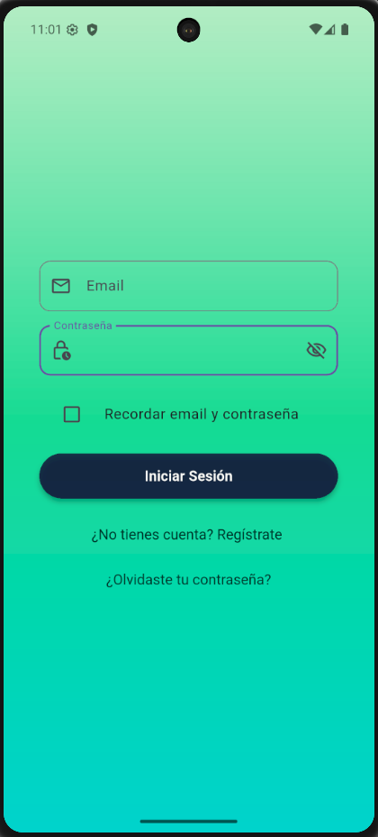
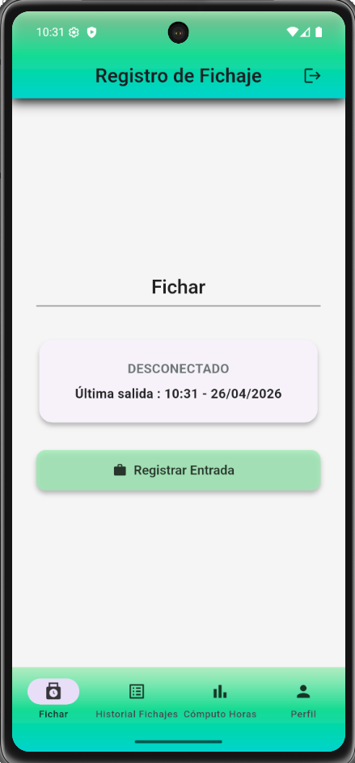
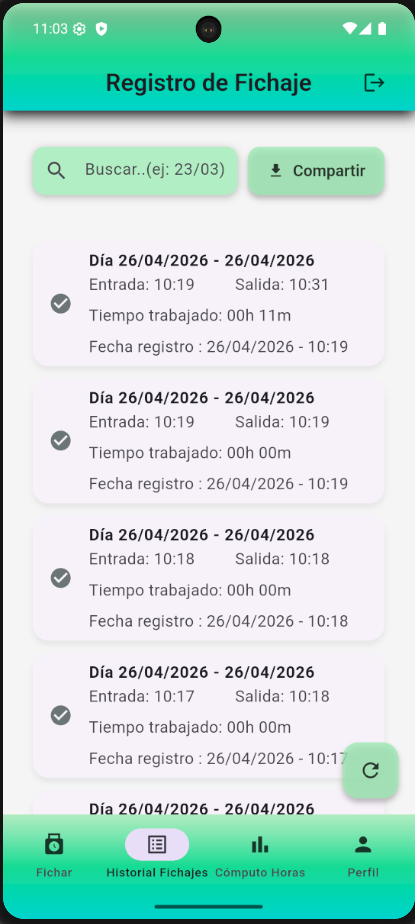
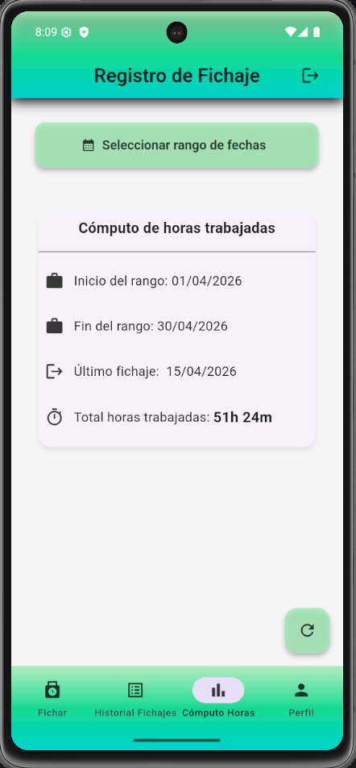

# Aplicación de Fichajes | Time Tracking App

[Español](#español) | [English](#english)

---

<a name="español"></a>

## Español


### Descripción

Aplicación multiplataforma desarrollada en Flutter y Dart para el registro y cómputo de jornadas laborales. Permite al usuario fichar la entrada y salida de su jornada de trabajo, consultar el historial de fichajes, calcular el tiempo trabajado en un periodo seleccionable y exportar los registros en formato PDF o CSV.


> **Proyecto en desarrollo.** Algunas funcionalidades previstas están pendientes de implementación.


### Funcionalidades principales

- **Autenticación completa** — Registro, inicio de sesión, recuperación de contraseña mediante OTP y cierre de sesión
- **Fichaje de entrada y salida** — Registro de jornada 
- **Historial de fichajes** — Consulta por fecha
- **Exportación** — Descarga del historial en formato PDF y CSV
- **Cómputo de tiempo trabajado** — Resumen del tiempo acumulado en un rango de fechas seleccionable (por defecto el mes actual)
- **Gestión de perfil** 
- **Diseño responsive** — Adaptado a formato móvil y escritorio con navegación específica para cada formato

---

### Capturas de pantalla

| Login | Fichaje | Historial | Resumen |
|-------|---------|-----------|---------|
|  |  |  |  |
### Tecnologías

| Tecnología | Uso |
|------------|-----|
| Flutter / Dart | Framework multiplataforma — interfaz y lógica de negocio |
| Supabase | Backend, base de datos PostgreSQL y autenticación |
| go_router | Navegación declarativa con soporte web |
| flutter_secure_storage | Almacenamiento seguro de credenciales |
| pdf | Generación de documentos PDF |
| share_plus | Compartición y descarga de archivos |
| intl | Formateo de fechas y horas |
| flutter_dotenv | Gestión de variables de entorno |
---

### Estructura del proyecto

```
lib/
├── core/
│   ├── app_colors.dart             # Colores globales
│   └── app_theme.dart              # Tema y estilos globales
├── db/
│   └── supabase_config.dart        # Configuración de la conexión a Supabase
├── models/
│   ├── profiles.dart               # Modelo de perfil de usuario
│   └── time_entries.dart           # Modelo de fichaje
├── routes/
│   └── app_router.dart             # Definición de rutas con go_router
├── screens/
│   ├── clock_screen.dart           # Pantalla de fichaje
│   ├── forgot_password_screen.dart # Recuperación de contraseña
│   ├── home_screen.dart            # Contenedor principal con navegación
│   ├── login_screen.dart           # Inicio de sesión
│   ├── profile_screen.dart         # Gestión de perfil
│   ├── signup_screen.dart          # Registro de usuario
│   ├── splash_screen.dart          # Comprobación de sesión activa
│   ├── summary_screen.dart         # Cómputo de tiempo trabajado
│   └── time_entry_record_screen.dart  # Historial de fichajes
├── services/
│   ├── auth_service.dart           # Autenticación con Supabase Auth
│   ├── profile_service.dart        # Operaciones sobre perfiles
│   └── time_entry_service.dart     # Operaciones sobre fichajes
├── utils/
│   ├── auth_error_translator.dart  # Traducción de errores de autenticación
│   ├── export_helper.dart          # Exportación PDF y CSV
│   ├── input_validation.dart       # Validaciones de formularios
│   ├── preferences_keys.dart       # Claves para flutter_secure_storage
│   ├── snack_bar_messenger.dart    # Gestor de notificaciones
│   └── time_utils.dart             # Cálculo de duraciones
└── main.dart
```

---

### Instalación y puesta en marcha

#### Requisitos previos

- [Flutter SDK](https://docs.flutter.dev/get-started/install) versión 3.x o superior
- [Dart SDK](https://dart.dev/get-dart) versión ^3.11.0
- Una cuenta en [Supabase](https://supabase.com) con un proyecto creado
- Un emulador Android/iOS o dispositivo físico para la ejecución en móvil

#### 1. Clonar el repositorio

```bash
git clone https://github.com/alvarolassaletta/ProyectoIntermodular.git
cd ProyectoIntermodular
```

#### 2. Instalar dependencias

```bash
flutter pub get
```

#### 3. Configurar variables de entorno

Crea un archivo `.env` en la raíz del proyecto con el siguiente contenido:

```env
SUPABASE_URL=tu_url_de_supabase
SUPABASE_ANON_KEY=tu_clave_anonima_de_supabase
```

> **Nota:** Nunca subir el archivo `.env` al repositorio. Asegúrarse de que está incluido en el `.gitignore`.

Los valores se obtienen en el panel de tu proyecto de Supabase — **Settings → API**.

#### 4. Configurar la base de datos

Ejecuta los scripts SQL incluidos en la carpeta `/db` del proyecto para crear las tablas, funciones, triggers y políticas de seguridad necesarias en tu proyecto de Supabase.

---

### Ejecución

#### Web

```bash
flutter run -d chrome
```

#### Móvil (emulador)

```bash
# Ver emuladores disponibles
flutter emulators

# Lanzar un emulador concreto
flutter emulators --launch <id_del_emulador>

# Ejecutar la aplicación
flutter run
```

#### Móvil (dispositivo físico)

Conecta el dispositivo por USB con la depuración USB activada:

```bash
flutter run
```

---


### Autor

**Álvaro Lassaletta Indiano**  

---

<a name="english"></a>

---

## English


### Description

Cross-platform application built with Flutter and Dart for recording and tracking working hours. It allows users to clock in and out of their work shifts, consult their time entry history, calculate total hours worked within a selectable date range, and export records in PDF or CSV format.


> **Work in progress.** Some planned features are still pending implementation.

---

### Main features

- **Full authentication** — Registration, login, OTP-based password recovery and logout
- **Clock in / Clock out** — Work shift recording with UTC timestamp converted to local time
- **Time entry history** — Filter time entries by date
- **Export** — Download history in PDF and CSV format
- **Working time summary** — Total accumulated time within a selectable date range (defaults to current month)
- **Profile management** 
- **Responsive design** — Adapted for mobile and desktop with format-specific navigation

---

### Tech stack

| Technology | Usage |
|------------|-------|
| Flutter / Dart | Cross-platform framework — UI and business logic |
| Supabase | Backend, PostgreSQL database and authentication |
| go_router | Declarative navigation with web support |
| flutter_secure_storage | Secure credential storage |
| pdf | PDF document generation |
| share_plus | File sharing and download |
| intl | Date and time formatting |
| flutter_dotenv | Environment variable management |

---

### Installation

#### Prerequisites

- [Flutter SDK](https://docs.flutter.dev/get-started/install) version 3.x or higher
- [Dart SDK](https://dart.dev/get-dart) version ^3.11.0
- A [Supabase](https://supabase.com) account with a project created
- An Android/iOS emulator or physical device for mobile testing

#### 1. Clone the repository

```bash
git clone https://github.com/alvarolassaletta/ProyectoIntermodular.git
cd ProyectoIntermodular
```

#### 2. Install dependencies

```bash
flutter pub get
```

#### 3. Set up environment variables

Create a `.env` file in the project root:

```env
SUPABASE_URL=your_supabase_url
SUPABASE_ANON_KEY=your_supabase_anon_key
```

> **Note:** Never commit the `.env` file to the repository. Make sure it is listed in `.gitignore`.

These values are available in your Supabase project dashboard — **Settings → API**.

#### 4. Set up the database

Run the SQL scripts located in the `/db` folder to create the required tables, functions, triggers and Row Level Security policies in your Supabase project.

---

### Running the app

#### Web

```bash
flutter run -d chrome
```

#### Mobile (emulator)

```bash
# List available emulators
flutter emulators

# Launch a specific emulator
flutter emulators --launch <emulator_id>

# Run the app
flutter run
```

#### Mobile (physical device)

Connect your device via USB with USB debugging enabled:

```bash
flutter run
```

### Author

**Álvaro Lassaletta Indiano**  

